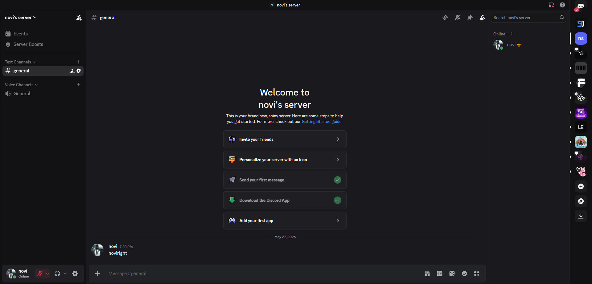

## This repo isnt being updated, as it was a 1 time project and wasent meant to be updated daily... fork it if you want to.

# noviright 🌌

moves the discord server bar to the right side.

### preview

### features
- **right side guilds** — server bar anchored to the right edge
- **fixed badges** — pings and unreads repositioned so they dont clip
- **clean scrollbar** — guild scroller hidden

### install

**vencord / vesktop / betterdiscord**
1. copy the raw link to `noviright.theme.css`
2. open client settings → **themes**
3. paste the link in online themes

**or just use this link**
https://raw.githubusercontent.com/novimp3/noviright/main/noviright.theme.css

### website

### note
open source. fork it if you want, just give credits.
